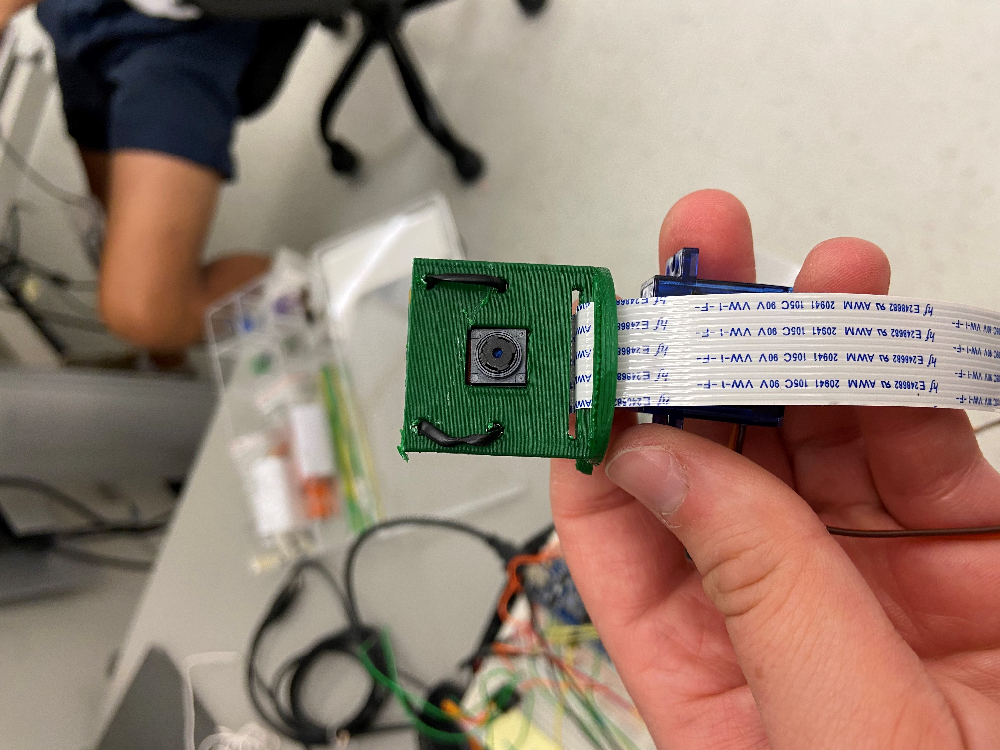

<p align="center"></p>
<p align="center"></p>

&nbsp;&nbsp;&nbsp;&nbsp;&nbsp;&nbsp;&nbsp;&nbsp;&nbsp;&nbsp;&nbsp;&nbsp;&nbsp;&nbsp;&nbsp;&nbsp;&nbsp;&nbsp;&nbsp;

[](https://travis-ci.org/anfederico/Clairvoyant)

[](https://github.com/zarif98/ECE4180RCProject/issues)

[](https://opensource.org/licenses/MIT)

# To Do (Delete after)

- ~~Team members~~
- ~~parts list~~
- schematic
- source code
- photos & videoes
- Powerpoint for video presentation (6 slides max) final slide for further ideas

Checkout the website: http://zarifandr.com/ECE4180RCProject/

## Basic Overview

Build an RC car using the shadow chassis with Xbox controls and Pi cam at the front. The Pi streams video onto a web app
accessible by anyone on the same wifi network.

<br>

## Latest Development Changes

```bash
git clone https://github.com/zarif98/ECE4180RCProject.git
```

# Setup

## Assembling the Shadow Chasis Robot

Click on the image below to watch the video guide
[](http://www.youtube.com/watch?v=aJRYTqZu5OE&t "SparkFun - Shadow Chassis Assembly Guide")

## Connecting the Controller

Follow these steps to connect the Xbox One controller to the Raspberry Pi:

```
https://pimylifeup.com/xbox-controllers-raspberry-pi/
```

The source code to run the controller can be found in the Pi-Controller folder. The Pi-contoller code looks for 6 different inputs: X and Y of the left analog joystick (for driving), Left and Right Triggers (for moving the camera), and A and B button (for playing sounds). This code runs simultaneously with the Pi camera stream code.

## Streaming and Pi Camera

The RC car is equipped with a Pi cam at the front of the car. The camera is powered by a Raspberry Pi 4. The streaming website is written in Flask and interfaces with the camera. I would recommend running the website on a phone hotspot rather than GT wifi. Your website address should look something similar to this:

```
<raspberry_pi_ip:5000>
```

The Pi cam was also equipped with motion detection due to the fact that object detection runs at a measly 2fps on the Pi 4. We can maintain our 24fps on the Raspi 4 with motion detection running at 5fps. Fork over the Pi Stream folder to run the code and hit main.py

<br>
Here's our Camera.py code. For more information click on the Pi-camera -stream-flask folder

```
import cv2
from imutils.video.pivideostream import PiVideoStream
import imutils
import time
import numpy as

class VideoCamera(object):
    def __init__(self, flip = False):
        self.vs = PiVideoStream().start()
        self.flip = flip
        time.sleep(2.0)

    def __del__(self):
        self.vs.stop()

    def flip_if_needed(self, frame):
        if self.flip:
            return np.flip(frame, 0)
        return frame

    def get_frame(self):
        frame = self.flip_if_needed(self.vs.read())
        ret, jpeg = cv2.imencode('.jpg', frame)
        return jpeg.tobytes()
```

# Mbed Code

This is the code for the first mbed we used. This mbed was used to process the Pi serial commands that controlled the H-bridge for the two motors as well as the servo motor.

```
#include "mbed.h" // using namespace mbed; from Lab3-4_BT
#include "Motor.h" // #include "motordriver.h" // equivalent to DCMotor.h from class... might be more useful
//#include "uLCD_4DGL.h" // debugging
#include <cstdlib>
#include <string>
#include <string.h>
#include <ctype.h>
#include "Speaker.h"
#include "Servo.h"


Motor motor_right(p25, p20, p23); // pwm a, fwd (AI1), rev (AI2)
Motor motor_left(p26, p21, p22); // pwm b, fwd (BI1), rev (BI2)
Serial pi(USBTX, USBRX); // RawSerial
Servo cam_servo(p24); //Servo
DigitalOut mbed_led1(LED1);
DigitalOut mbed_led2(LED2);

const int MAX_BUFFER_SIZE = 128; // max number of possible chars -> pow2
char buffer[MAX_BUFFER_SIZE];
float buffer_to_int[6];
int spaces[6];

bool left = true;

int main() {
    mbed_led1 = 1;
    pi.baud(9600);
    while(1) {
        mbed_led1 = !mbed_led1;
        wait(0.2);
        int index = 0;
        buffer[0] = '\0';
        while (pi.readable() && index < MAX_BUFFER_SIZE) {
            buffer[index++] = pi.getc();
        }
        spaces[0] = -1;
        int i = 0;
        int count = 1;
        while (buffer[i]) {
            if (isspace(buffer[i])) {
                spaces[count++] = i;
            }
            i++;
        }
        for (int i = 0; i < 5; i++) {
            int starting = spaces[i] + 1;
            int ending = spaces[i+1];
            string s = "";
            while (starting < ending) {
                mbed_led2 = !mbed_led2;
                s += buffer[starting++];
            }
            buffer_to_int[i] = atof(s.c_str());
        }

        motor_left.speed(buffer_to_int[0]);
        motor_right.speed(-buffer_to_int[1]);

        float turn_left_cam = buffer_to_int[2];
        float turn_right_cam = buffer_to_int[3];
        if (turn_left_cam < 0 || turn_right_cam < 0 || // not triggering
                turn_left_cam > 0 && turn_right_cam > 0 || // holding both triggers
                cam_servo == 0.0 && turn_left_cam > 0 || // max left
                cam_servo == 1.0 && turn_right_cam > 0) { // max right
            float increm = (turn_left_cam > 0 ? -1 * cam_servo * 0.1 : -(1-cam_servo) * 0.1);
            float new_pos = cam_servo + increm;
            cam_servo = (new_pos > 1.0 ? 1.0 : (new_pos < 0.0 ? 0.0 : new_pos));
        }
    }
}
```

# Hardware

## Parts List

<br>

|            Part Name             | Quantity |
| :------------------------------: | :------: |
|           mbed LPC1768           |    2     |
|  Hobby DC Gear Motor - 140 rpm   |    2     |
|       Shadow Robot Chassis       |    1     |
|      Sparkfun Dual H Bridge      |    1     |
|          Battery Holder          |    1     |
|       Xbox One Controller        |    1     |
|          Raspberry Pi 4          |    1     |
|      Raspberry Pi Cam V2.1       |    1     |
|      HC-SR04 (Sonar Sensor)      |    2     |
|        Speaker PCB Mount         |    1     |
| SparkFun Mono Audio Amp Breakout |    1     |
|      Anker Portable Battery      |    1     |
|         Micro Servo SG90         |    1     |

<br>
<br>

## Wheel Motors and H-Bridge Pinouts

| Mbed 1 | Dual H-Bridge | Left DC Motors | Right DC Motors | Pin 2 on Pi | Pin 6 on Pi |
| :----: | :-----------: | :------------: | :-------------: | :---------: | :---------: |
|  Vout  |   Vcc, STBY   |       nc       |       nc        |     nc      |     nc      |
|   nc   |      Vm       |       nc       |       nc        |     5V+     |     nc      |
|  GND   |      GND      |       nc       |       nc        |     nc      |     GND     |
|  P26   |     PWMB      |       nc       |       nc        |     nc      |     nc      |
|  P25   |     PWMA      |       nc       |       nc        |     nc      |     nc      |
|  P20   |      AI1      |       nc       |       nc        |     nc      |     nc      |
|  P23   |      AI2      |       nc       |       nc        |     nc      |     nc      |
|  P22   |      BI2      |       nc       |       nc        |     nc      |     nc      |
|  P21   |      BI1      |       nc       |       nc        |     nc      |     nc      |
|   nc   |      A01      |       +        |       nc        |     nc      |     nc      |
|   nc   |      A02      |       -        |       nc        |     nc      |     nc      |
|   nc   |      B01      |       nc       |        +        |     nc      |     nc      |
|   nc   |      B02      |       nc       |        -        |     nc      |     nc      |

## Speaker and Mono Audio Amp Pinouts

| Mbed 2 | Mono Audio Amp | Speaker | Pin 2 on Pi | Pin 6 on Pi |
| :----: | :------------: | :-----: | :---------: | :---------: |
|  P18   |      IN+       |   nc    |     nc      |     nc      |
|  GND   |   PWR-, IN-    |   nc    |     nc      |     GND     |
|   nc   |      OUT+      |    +    |     nc      |     nc      |
|   nc   |      OUT-      |    -    |     nc      |     nc      |
|   nc   |      PWR+      |   nc    |     5V+     |     nc      |

## Left Side Sonar Sensor Pinouts

| Mbed 2 | Left HC-SR04 | Pin 2 on Pi | Pin 6 on Pi |
| :----: | :----------: | :---------: | :---------: |
|  GND   |     GND      |     nc      |     GND     |
|   nc   |     Vcc      |     5V+     |     nc      |
|   P6   |     Trig     |     nc      |     nc      |
|   P7   |     Echo     |     nc      |     nc      |

## Right Side Sonar Sensor Pinouts

| Mbed 2 | Right HC-SR04 | Pin 2 on Pi | Pin 6 on Pi |
| :----: | :-----------: | :---------: | :---------: |
|  GND   |      GND      |     nc      |     GND     |
|   nc   |      Vcc      |     5V+     |     nc      |
|  P12   |     Trig      |     nc      |     nc      |
|  P13   |     Echo      |     nc      |     nc      |

## Pi Camera Servo Motor

| Mbed 1 | Micro Servo SG90 | Pin 2 on Pi | Pin 6 on Pi |
| :----: | :--------------: | :---------: | :---------: |
|  GND   |      Brown       |     nc      |     GND     |
|   nc   |       Red        |     5V+     |     nc      |
|  P24   |      Orange      |     nc      |     nc      |

## Pi Camera Servo Mount

The pi camera servo mount was designed based off an existing servo mount but it was extend to include a semi-circle base that contained the pi camera mount on it. The mount was 3D printed at the Invention Studio in the MDCR. It was mounted to the microservo motor using a screw. The STereoLithography (STL) file and inventor file are included on the GitHub page.

<p align="center"></p>
<p align="center"></p>

# Demo

[](https://www.youtube.com/watch?v=TS9khvXI--E "RC Car Demo")

# Presentation

# Contributing

Feel free to fork over and utilize our code for future projects. Our goal was to utilize the material that we accumulated over the semester in our embedded systems class and combine the skills we learned into one project.

#### Team Members

- Nicole Komocsar
- Zarif Rahman
- Marcus Chan
- Alan Jin
