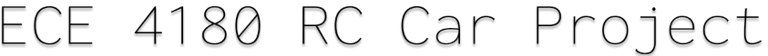

<p align="center"></p>
<p align="center"></p>

&nbsp;&nbsp;&nbsp;&nbsp;&nbsp;&nbsp;&nbsp;&nbsp;&nbsp;&nbsp;&nbsp;&nbsp;&nbsp;&nbsp;&nbsp;&nbsp;&nbsp;&nbsp;&nbsp;

[](https://travis-ci.org/anfederico/Clairvoyant)

[](https://github.com/zarif98/ECE4180RCProject/issues)

[](https://opensource.org/licenses/MIT)

# To Do (Delete after)

- ~~Team members~~
- ~~parts list~~
- schematic
- source code
- photos & videoes
- Powerpoint for video presentation (6 slides max) final slide for further ideas

## Basic Overview

Build an RC car using the shadow chassis with Xbox controls and Pi cam at the front. The Pi streams video onto a web app
accessible by anyone on the same wifi network.

<br>

## Latest Development Changes

```bash
git clone https://github.com/zarif98/ECE4180RCProject.git
```

## Streaming and Pi Camera

The RC car is equipped with a Pi cam at the front of the car. The camera is powered by a Raspberry Pi 4. The streaming website is written in Flask and interfaces with the camera. I would recommend running the website on a phone hotspot rather than GT wifi. Your website address should look something similar to this:

```
<raspberry_pi_ip:5000>
```

The Pi cam was also equipped with motion detection due to the fact that object detection runs at a measly 2fps on the Pi 4. We can maintain our 24fps on the Raspi 4 with motion detection running at 5fps. Fork over the Pi Stream folder to run the code and hit main.py

<br>

## Backtesting Signal Accuracy

During the testing period, the model signals to buy or sell based on its prediction for price
movement the following day. By putting your trading algorithm aside and testing for signal accuracy
alone, you can rapidly build and test more reliable models.

```python
from clairvoyant.engine import Backtest
import pandas as pd

features  = ["EMA", "SSO"]   # Financial indicators of choice
trainStart = 0               # Start of training period
trainEnd   = 700             # End of training period
testStart  = 701             # Start of testing period
testEnd    = 1000            # End of testing period
buyThreshold  = 0.65         # Confidence threshold for predicting buy (default = 0.65)
sellThreshold = 0.65         # Confidence threshold for predicting sell (default = 0.65)
continuedTraining = False    # Continue training during testing period? (default = false)

# Initialize backtester
backtest = Backtest(features, trainStart, trainEnd, testStart, testEnd, buyThreshold, sellThreshold, continuedTraining)

# A little bit of pre-processing
data = pd.read_csv("SBUX.csv", date_parser=['date'])
data = data.round(3)

# Start backtesting and optionally modify SVC parameters
# Available paramaters can be found at: http://scikit-learn.org/stable/modules/generated/sklearn.svm.SVC.html
backtest.start(data, kernel='rbf', C=1, gamma=10)
backtest.conditions()
backtest.statistics()
backtest.visualize('SBUX')
```

### Hardware

## Required Parts

The primary purpose of this project is to rapidly test datasets on machine learning algorithms (specifically Support Vector Machines). While the Simulation class allows for basic strategy testing, there are other projects more suited for that task. Once you've tested patterns within your data and simulated a basic strategy, I'd recommend taking your model to the next level with:

<br>
<br>

|            Part Name             | Quantity |
| :------------------------------: | :------: |
|           mbed LPC1768           |    1     |
|  Hobby DC Gear Motor - 140 rpm   |    2     |
|       Shadow Robot Chassis       |    1     |
|      Sparkfun Dual H Bridge      |    1     |
|          Battery Holder          |    1     |
|       Xbox One Controller        |    1     |
|          Raspberry Pi 4          |    1     |
|      Raspberry Pi Cam V2.1       |    1     |
|      HC-SR04(Sonar Sensor)       |    2     |
|        Speaker PCB Mount         |    1     |
| SparkFun Mono Audio Amp Breakout |    1     |
|      Anker Portable Battery      |    1     |

<br>
<br>

# Motors and H-Bridge Pinouts

| Mbed | Dual H-Bridge | Left DC Motors | Right DC Motors | Battery |
| :--: | :-----------: | :------------: | :-------------: | :-----: |
| Vout |   Vcc, STBY   |       nc       |       nc        |   nc    |
|  nc  |      Vm       |       nc       |       nc        |   6V+   |
| GND  |      GND      |       nc       |       nc        |   GND   |
| P26  |     PWMB      |       nc       |       nc        |   nc    |
| P25  |     PWMA      |       nc       |       nc        |   nc    |
| P24  |      AI1      |       nc       |       nc        |   nc    |
| P23  |      AI2      |       nc       |       nc        |   nc    |
| P24  |      BI2      |       nc       |       nc        |   nc    |
| P23  |      BI1      |       nc       |       nc        |   nc    |
|  nc  |      A01      |       nc       |        +        |   nc    |
|  nc  |      A02      |       nc       |        -        |   nc    |
|  nc  |      B01      |       nc       |        +        |   nc    |
|  nc  |      B02      |       nc       |        -        |   nc    |

# Speaker and Mono Audio Amp Pinouts

| Mbed | Mono Audio Amp | Speaker | Battery |
| :--: | :------------: | :-----: | :-----: |
| P18  |      IN+       |   nc    |   nc    |
| GND  |   PWR-, IN-    |   nc    |   GND   |
|  nc  |      OUT+      |    +    |   nc    |
|  nc  |      OUT-      |    -    |   nc    |

# Left Side Sonar Sensor Pinouts

| Mbed | Left HC-SR04 | Battery |
| :--: | :----------: | :-----: |
| GND  |     GND      |   GND   |
|  nc  |     Vcc      |   6V+   |
|  P6  |     Trig     |   nc    |
|  P7  |     Echo     |   nc    |

# Right Side Sonar Sensor Pinouts

| Mbed | Right HC-SR04 | Battery |
| :--: | :-----------: | :-----: |
| GND  |      GND      |   GND   |
|  nc  |      Vcc      |   6V+   |
| P12  |     Trig      |   nc    |
| P13  |     Echo      |   nc    |

#### Social Sentiment Scores

The examples shown use data derived from a project where we are data mining social media and performing stock sentiment analysis. To get an idea of how we do that, please take a look at:

```text
https://github.com/anfederico/Stocktalk
```

## Notes

```python
variables = ["SSO"]                            # 1 feature
variables = ["SSO", "SSC"]                     # 2 features
variables = ["SSO", "SSC", "RSI"]              # 3 features
variables = ["SSO", "SSC", "RSI", ... , "Xn"]  # n features
```

## Contributing

Feel free to fork over and utilize our code for future projects. Our goal was to utilize the material that we accumulated over the semester and combine them into one project.

#### Team Members

- Nicole Komocsar
- Zarif Rahman
- Marcus Chan
- Alan Jin
